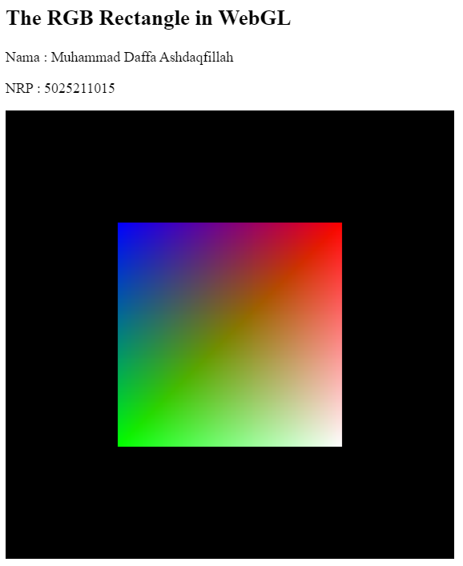

# Task 3

<aside>
5025211015 - Muhammad Daffa Ashdaqfillah
</aside>

## Point 1 - Create A Rectangle

### 1. Cara pertama : Menggunakan Triangle Strip

```jsx
function draw() { 

    gl.clearColor(0,0,0,1); 
    gl.clear(gl.COLOR_BUFFER_BIT);

let coords = new Float32Array([
        -0.5, 0.5,    // Top-left corner
        0.5, 0.5,       // Top-right corner
        -0.5, -0.5,   // Bottom-left corner
        0.5, -0.5    // Bottom-right corner
    ]);

    gl.bindBuffer(gl.ARRAY_BUFFER, bufferCoords);
    gl.bufferData(gl.ARRAY_BUFFER, coords, gl.STREAM_DRAW);
    gl.vertexAttribPointer(attributeCoords, 2, gl.FLOAT, false, 0, 0);
    gl.enableVertexAttribArray(attributeCoords);

    let color = new Float32Array([
        0, 0, 1,  // Red
        1, 0, 0,   // Red
        0, 1, 0,  // Blue
        1, 1, 1,  // Green
    ]);

    gl.bindBuffer(gl.ARRAY_BUFFER, bufferColor);
    gl.bufferData(gl.ARRAY_BUFFER, color, gl.STREAM_DRAW);
    gl.vertexAttribPointer(attributeColor, 3, gl.FLOAT, false, 0, 0);
    gl.enableVertexAttribArray(attributeColor);

    gl.drawArrays(gl.TRIANGLE_STRIP, 0, 4); 
    
}
```

Di sini saya mengedit dari file yang segitiga menjadi kotak melalui function `draw` . Langkah-langkah yang dilakukan oleh fungsi `draw` adalah sebagai berikut:

1. Mengatur warna latar belakang dengan `gl.clearColor(0,0,0,1)` dan membersihkan canvas dengan `gl.clear(gl.COLOR_BUFFER_BIT)`.
2. Membuat array `coords` yang berisi koordinat-koordinat sudut-sudut dari persegi panjang. Setiap titik sudut memiliki dua nilai koordinat x dan y.
3. Menghubungkan buffer koordinat dengan `gl.bindBuffer(gl.ARRAY_BUFFER, bufferCoords)` dan mengisi data koordinat ke buffer dengan `gl.bufferData(gl.ARRAY_BUFFER, coords, gl.STREAM_DRAW)`. Kemudian, mengatur pointer attribut koordinat dengan `gl.vertexAttribPointer(attributeCoords, 2, gl.FLOAT, false, 0, 0)` dan mengaktifkan atribut koordinat dengan `gl.enableVertexAttribArray(attributeCoords)`.
4. Membuat array `color` yang berisi nilai-nilai warna untuk setiap titik sudut, dalam format RGB.
5. Menghubungkan buffer warna dengan `gl.bindBuffer(gl.ARRAY_BUFFER, bufferColor)` dan mengisi data warna ke buffer dengan `gl.bufferData(gl.ARRAY_BUFFER, color, gl.STREAM_DRAW)`. Kemudian, mengatur pointer attribut warna dengan `gl.vertexAttribPointer(attributeColor, 3, gl.FLOAT, false, 0, 0)` dan mengaktifkan atribut warna dengan `gl.enableVertexAttribArray(attributeColor)`.
6. Menggambar persegi panjang menggunakan metode Triangle Strip dengan `gl.drawArrays(gl.TRIANGLE_STRIP, 0, 4)`, di mana parameter kedua adalah indeks awal dan parameter ketiga adalah jumlah titik yang akan digambar.

Hasil dari cara pertama adalah seperti ini :



### 2. Cara kedua : Menggunakan 2 Triangle

```jsx
let coords = new Float32Array([
        -0.5, 0.5,    // Top-left corner
        -0.5, -0.5,   // Bottom-left corner
        0.5, -0.5,    // Bottom-right corner
        0.5, 0.5,      // Top-right corner
        0.5, -0.5,    // Bottom-right corner
        -0.5, 0.5,    // Top-left corner
    ]);

    gl.bindBuffer(gl.ARRAY_BUFFER, bufferCoords);
    gl.bufferData(gl.ARRAY_BUFFER, coords, gl.STREAM_DRAW);
    gl.vertexAttribPointer(attributeCoords, 2, gl.FLOAT, false, 0, 0);
    gl.enableVertexAttribArray(attributeCoords);

    let color = new Float32Array([
        0, 0, 1, // blue, Top-left corner
        0, 1, 0, // green, Bottom-left corner
        1, 1, 1, // white, Bottom-right corner
        1, 0, 0, // red, Top-right corner
        1, 1, 1, // white, Bottom-right corner
        0, 0, 1, // blue, Top-left corner
    ]);

    gl.bindBuffer(gl.ARRAY_BUFFER, bufferColor);
    gl.bufferData(gl.ARRAY_BUFFER, color, gl.STREAM_DRAW);
    gl.vertexAttribPointer(attributeColor, 3, gl.FLOAT, false, 0, 0);
    gl.enableVertexAttribArray(attributeColor);

    gl.drawArrays(gl.TRIANGLES, 0, 6);
```

Fungsi `draw` dalam WebGL ini digunakan untuk menggambar persegi panjang dengan menggunakan metode `gl.drawArrays`. Fungsi ini memiliki langkah-langkah sebagai berikut:

1. Mengatur warna latar belakang dengan `gl.clearColor(0,0,0,1)` dan membersihkan area gambar dengan `gl.clear(gl.COLOR_BUFFER_BIT)`.
2. Membuat array `coords` yang berisi koordinat-koordinat sudut-sudut persegi panjang. Setiap titik sudut memiliki dua nilai koordinat x dan y.
3. Menghubungkan buffer koordinat dengan `gl.bindBuffer(gl.ARRAY_BUFFER, bufferCoords)` dan mengisi data koordinat ke buffer dengan `gl.bufferData(gl.ARRAY_BUFFER, coords, gl.STREAM_DRAW)`. Kemudian, mengatur pointer atribut koordinat dengan `gl.vertexAttribPointer(attributeCoords, 2, gl.FLOAT, false, 0, 0)` dan mengaktifkan atribut koordinat dengan `gl.enableVertexAttribArray(attributeCoords)`.
4. Membuat array `color` yang berisi nilai-nilai warna untuk setiap titik sudut, dalam format RGB.
5. Menghubungkan buffer warna dengan `gl.bindBuffer(gl.ARRAY_BUFFER, bufferColor)` dan mengisi data warna ke buffer dengan `gl.bufferData(gl.ARRAY_BUFFER, color, gl.STREAM_DRAW)`. Kemudian, mengatur pointer atribut warna dengan `gl.vertexAttribPointer(attributeColor, 3, gl.FLOAT, false, 0, 0)` dan mengaktifkan atribut warna dengan `gl.enableVertexAttribArray(attributeColor)`.
6. Menggambar persegi menggunakan metode `gl.drawArrays(gl.TRIANGLES, 0, 6)`, di mana `gl.TRIANGLES` mengindikasikan bahwa setiap tiga titik dalam array koordinat akan membentuk sebuah segitiga, dan `6` adalah jumlah titik yang akan digambar.

Perbedaan antara cara pertama (menggunakan Triangle Strip) dengan cara kedua (menggunakan 2 Triangle) terletak pada urutan penentuan koordinat sudut-sudut persegi panjang. Pada cara pertama, urutan koordinat sudut-sudutnya adalah top-left, top-right, bottom-left, dan bottom-right, sedangkan pada cara kedua, urutan koordinat sudut-sudutnya adalah top-left, bottom-left, bottom-right, top-right, bottom-right, dan top-left.

Hasil dari cara kedua adalah seperti ini :


## Point 2 - View A Cube

Dari contoh 1 yang diberikan dan gl-matrix-min.js, Harus ada penambahan rotator untuk bisa melihat view kubus dari segala sisi. Oleh karena itu dalam code di modifikasi menjadi seperti berikut :

```jsx
<!DOCTYPE html>
<!-- saved from url=(0079)https://math.hws.edu/graphicsbook/source/webgl/cube-with-trackball-rotator.html -->
<html><head><meta http-equiv="Content-Type" content="text/html; charset=UTF-8">

<title>TrackballRotator Demo</title>
<style>
    body {
        background-color: #EEEEEE;
    }
</style>

<!--
    An example using a TrackballRotator, defined in TrackballRotator.js,
    to implement rotation by mouse.
-->

<script src="./TrackballRotator Demo_files/trackball-rotator.js.download"></script>
<script src="./TrackballRotator Demo_files/gl-matrix-min.js.download"></script>

<script>

"use strict";

const vertexShaderSource = `
attribute vec3 a_coords;
uniform mat4 modelviewProjection;
void main() {
    vec4 coords = vec4(a_coords,1.0);
    gl_Position = modelviewProjection * coords;
}`;

const fragmentShaderSource = `
#ifdef GL_FRAGMENT_PRECISION_HIGH
   precision highp float;
#else
   precision mediump float;
#endif
uniform vec4 color;
void main() {
    gl_FragColor = color;
}`;

let gl;   // The webgl context.

let a_coords_loc;          // Location of the a_coords attribute variable in the shader program.
let a_coords_buffer;       // Buffer to hold the values for a_coords.
let u_color;               // Location of the uniform specifying a color for the primitive.
let u_modelviewProjection; // Location of the uniform matrix representing the combined transformation.

const projection = mat4.create();  // projection matrix
const modelviewProjection = mat4.create();  // combined matrix

let rotator;  // A SimpleRotator object that lets the user rotate the view by mouse.

/* Draws a WebGL primitive.  The first parameter must be one of the constants
 * that specify primitives:  gl.POINTS, gl.LINES, gl.LINE_LOOP, gl.LINE_STRIP,
 * gl.TRIANGLES, gl.TRIANGLE_STRIP, gl.TRIANGLE_FAN.  The second parameter must
 * be an array of 4 numbers in the range 0.0 to 1.0, giving the RGBA color of
 * the color of the primitive.  The third parameter must be an array of numbers.
 * The length of the array must be a multiple of 3.  Each triple of numbers provides
 * xyz-coords for one vertex for the primitive.  This assumes that u_color is the
 * location of a color uniform in the shader program, a_coords_loc is the location of
 * the coords attribute, and a_coords_buffer is a VBO for the coords attribute.
 */
function drawPrimitive( primitiveType, color, vertices ) {
     gl.enableVertexAttribArray(a_coords_loc);
     gl.bindBuffer(gl.ARRAY_BUFFER,a_coords_buffer);
     gl.bufferData(gl.ARRAY_BUFFER, new Float32Array(vertices), gl.STREAM_DRAW);
     gl.uniform4fv(u_color, color);
     gl.vertexAttribPointer(a_coords_loc, 3, gl.FLOAT, false, 0, 0);
     gl.drawArrays(primitiveType, 0, vertices.length/3);
}

/* Draws a colored cube, along with a set of coordinate axes.
 * (Note that the use of the above drawPrimitive function is not an efficient
 * way to draw with WebGL.  Here, the geometry is so simple that it doesn't matter.)
 */
function draw() { 
    gl.clearColor(0,0,0,1);
    gl.clear(gl.COLOR_BUFFER_BIT | gl.DEPTH_BUFFER_BIT);
    
    /* Set the value of projection to represent the projection transformation */
    
    mat4.perspective(projection, Math.PI/8, 1, 8, 12);
    
    /* Get the view matrix from the SimpleRotator object.
       There is no modeling transformation in this program. */
    
    let modelview = rotator.getViewMatrix();
        
    /* Multiply the projection matrix times the modelview matrix to give the
       combined transformation matrix, and send that to the shader program. */
       
    mat4.multiply( modelviewProjection, projection, modelview );
    gl.uniformMatrix4fv(u_modelviewProjection, false, modelviewProjection );
    
    /* Draw the six faces of a cube, with different colors. */
    
    drawPrimitive( gl.TRIANGLE_FAN, [1,0,0,1], [ -1,-1,1, 1,-1,1, 1,1,1, -1,1,1 ]);
    drawPrimitive( gl.TRIANGLE_FAN, [0,1,0,1], [ -1,-1,-1, -1,1,-1, 1,1,-1, 1,-1,-1 ]);
    drawPrimitive( gl.TRIANGLE_FAN, [0,0,1,1], [ -1,1,-1, -1,1,1, 1,1,1, 1,1,-1 ]);
    drawPrimitive( gl.TRIANGLE_FAN, [1,1,0,1], [ -1,-1,-1, 1,-1,-1, 1,-1,1, -1,-1,1 ]);
    drawPrimitive( gl.TRIANGLE_FAN, [1,0,1,1], [ 1,-1,-1, 1,1,-1, 1,1,1, 1,-1,1 ]);
    drawPrimitive( gl.TRIANGLE_FAN, [0,1,1,1], [ -1,-1,-1, -1,-1,1, -1,1,1, -1,1,-1 ]);
    
    /* Draw coordinate axes as thick colored lines that extend through the cube. */
    
    gl.lineWidth(4);
    drawPrimitive( gl.LINES, [1,0,0,1], [ -2,0,0, 2,0,0] );
    drawPrimitive( gl.LINES, [0,1,0,1], [ 0,-2,0, 0,2,0] );
    drawPrimitive( gl.LINES, [0,0,1,1], [ 0,0,-2, 0,0,2] );
    gl.lineWidth(1);
}

/* Initialize the WebGL context.  Called from init() */
function initGL() {
    let prog = createProgram( gl, vertexShaderSource, fragmentShaderSource );
    gl.useProgram(prog);
    a_coords_loc =  gl.getAttribLocation(prog, "a_coords");
    u_modelviewProjection = gl.getUniformLocation(prog, "modelviewProjection");
    u_color =  gl.getUniformLocation(prog, "color");
    a_coords_buffer = gl.createBuffer();
    gl.enable(gl.DEPTH_TEST);
}

/* Creates a program for use in the WebGL context gl, and returns the
 * identifier for that program.  If an error occurs while compiling or
 * linking the program, an exception of type Error is thrown.  The error
 * string contains the compilation or linking error.  If no error occurs,
 * the program identifier is the return value of the function.
 *    The second and third parameters are strings that contain the
 * source code for the vertex shader and for the fragment shader.
 */
function createProgram(gl, vShader, fShader) {
    let vsh = gl.createShader( gl.VERTEX_SHADER );
    gl.shaderSource(vsh,vShader);
    gl.compileShader(vsh);
    if ( ! gl.getShaderParameter(vsh, gl.COMPILE_STATUS) ) {
        throw new Error("Error in vertex shader:  " + gl.getShaderInfoLog(vsh));
     }
    let fsh = gl.createShader( gl.FRAGMENT_SHADER );
    gl.shaderSource(fsh, fShader);
    gl.compileShader(fsh);
    if ( ! gl.getShaderParameter(fsh, gl.COMPILE_STATUS) ) {
       throw new Error("Error in fragment shader:  " + gl.getShaderInfoLog(fsh));
    }
    let prog = gl.createProgram();
    gl.attachShader(prog,vsh);
    gl.attachShader(prog, fsh);
    gl.linkProgram(prog);
    if ( ! gl.getProgramParameter( prog, gl.LINK_STATUS) ) {
       throw new Error("Link error in program:  " + gl.getProgramInfoLog(prog));
    }
    return prog;
}

/**
 * initialization function that will be called when the page has loaded
 */
function init() {
    let canvas;
    try {
        canvas = document.getElementById("webglcanvas");
        gl = canvas.getContext("webgl");
        if ( ! gl ) {
            throw "Browser does not support WebGL";
        }
    }
    catch (e) {
        document.getElementById("canvas-holder").innerHTML =
            "<p>Sorry, could not get a WebGL graphics context.</p>";
        return;
    }
    try {
        initGL();  // initialize the WebGL graphics context
    }
    catch (e) {
        document.getElementById("canvas-holder").innerHTML =
            "<p>Sorry, could not initialize the WebGL graphics context: " + e + "</p>";
        return;
    }
    rotator = new TrackballRotator(canvas, draw, 10);
    draw();
}

</script>
<body onload="init()">

<h2>A Cube with "Trackball" Mouse Rotation</h2>

<p id="message">Drag your mouse on the cube to rotate it.<br>
(On a touch screen, you can use your finger.)</p>

<noscript><hr><h3>This page requires Javascript and a web browser that supports WebGL</h3><hr></noscript>

<div id="canvas-holder">
   <canvas width="600" height="600" id="webglcanvas" style="background-color:red"></canvas>
</div>
</body></html>
```

`TrackballRotator` adalah objek yang memungkinkan pengguna untuk mengatur rotasi tampilan dengan menggunakan mouse. Ini diterapkan melalui file `trackball-rotator.js`. Objek ini mengambil elemen `<canvas>` sebagai argumen konstruktor dan menggunakan fungsi `draw` sebagai callback untuk menggambar.

Fungsi `draw` adalah fungsi yang menggambar objek WebGL pada elemen `<canvas>`. Di dalamnya, terdapat beberapa langkah yang dilakukan:

1. Mengatur warna latar belakang dengan `gl.clearColor(0,0,0,1)` dan membersihkan buffer warna dengan `gl.clear(gl.COLOR_BUFFER_BIT | gl.DEPTH_BUFFER_BIT)`.
2. Mengatur nilai matriks proyeksi dengan `mat4.perspective(projection, Math.PI/8, 1, 8, 12)`, di mana `projection` adalah matriks proyeksi yang akan dikalikan dengan matriks modelview.
3. Mendapatkan matriks tampilan dari objek `rotator` menggunakan `rotator.getViewMatrix()`, yang menghasilkan matriks transformasi tampilan berdasarkan rotasi yang diterapkan oleh pengguna.
4. Mengalikan matriks proyeksi dengan matriks modelview untuk mendapatkan matriks transformasi yang digabungkan, dan mengirimkannya ke program shader dengan `gl.uniformMatrix4fv(u_modelviewProjection, false, modelviewProjection)`.
5. Menggambar sisi-sisi kubus menggunakan metode `drawPrimitive`. Setiap sisi didefinisikan sebagai `gl.TRIANGLE_FAN` dengan warna yang berbeda.
6. Menggambar sumbu koordinat sebagai garis berwarna tebal yang melintasi kubus dengan menggunakan metode `drawPrimitive` dengan `gl.LINES`.

Dengan menggunakan `TrackballRotator` dan menggambar kubus dengan fungsi `draw`, kubus dapat diputar oleh pengguna menggunakan mouse.

Sehingga hasil dari Rotate Cube seperti ini

- View 1
    
    
    
- View 2
    
    
    
- View 3
    
    